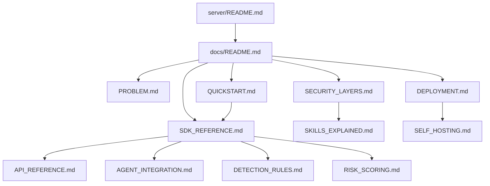

# Design Document: x402guard Developer Documentation

## Overview

This design document outlines the structure and content for comprehensive developer-friendly documentation for x402guard. The documentation will be organized as a collection of markdown files in the `docs/` directory, with a focus on explaining the problem, differentiating from x402-secure, and providing practical integration examples.

## Steering Document Alignment

### Technical Standards
- Documentation follows markdown best practices with GitHub-flavored markdown
- Code examples use TypeScript/JavaScript as primary language, with Python examples where applicable
- All code blocks include language specifiers for syntax highlighting
- Diagrams use ASCII art or mermaid syntax for portability

### Project Structure
- All documentation lives in `docs/` directory
- Main README.md in server/ provides quick overview
- Detailed docs are modular and cross-referenced

## Code Reuse Analysis

### Existing Components to Leverage
- **server/README.md**: Contains existing API reference and architecture diagrams - will be updated with x402guard branding
- **docs/QUICKSTART.md**: Existing quickstart guide - needs x402guard rename
- **docs/AGENT_INTEGRATION.md**: Integration examples - needs class name updates
- **docs/API_REFERENCE.md**: API docs - needs branding updates
- **examples/tests/test-x402-payment.ts**: Working example code to reference

### Integration Points
- **Existing docs structure**: Maintains current `docs/` folder organization
- **README.md hierarchy**: server/README.md → docs/README.md → specific guides

## Architecture

The documentation will be structured as follows:

```
docs/
├── README.md                    # Documentation index
├── PROBLEM.md                   # The security gap (NEW)
├── SECURITY_LAYERS.md           # x402guard vs x402-secure comparison (NEW)
├── SKILLS_EXPLAINED.md          # What are AI skills (NEW)
├── QUICKSTART.md                # Getting started (UPDATE)
├── SDK_REFERENCE.md             # X402GuardClient API (NEW)
├── DETECTION_RULES.md           # YARA rules documentation (NEW)
├── RISK_SCORING.md              # Scoring algorithm (NEW)
├── DEPLOYMENT.md                # Deployment guide (NEW)
├── API_REFERENCE.md             # HTTP API docs (UPDATE)
├── AGENT_INTEGRATION.md         # Framework integrations (UPDATE)
└── SELF_HOSTING.md              # Self-hosting guide (UPDATE)

server/
└── README.md                    # Main project README (UPDATE)

packages/
└── x402guard-client/            # Renamed from skillguard-client
    └── README.md                # SDK documentation (UPDATE)
```

### Modular Design Principles
- **Single File Responsibility**: Each doc file covers one topic
- **Component Isolation**: Docs are independent but cross-referenced
- **Progressive Disclosure**: README → Quickstart → Deep dives



## Components and Interfaces

### Component 1: PROBLEM.md
- **Purpose:** Explain the security gap x402guard fills
- **Content:**
  - The attack scenario (malicious skill steals credentials)
  - Why existing tools don't catch this
  - Real-world examples (Rufio's ClawdHub scan)
- **Dependencies:** None (entry point document)
- **Reuses:** Attack diagrams from server/README.md

### Component 2: SECURITY_LAYERS.md
- **Purpose:** Compare x402guard with x402-secure/Trustline
- **Content:**
  - 4-layer security stack diagram
  - tAudit explanation (what it covers)
  - x402guard explanation (what it covers)
  - Attack flow showing which layer catches what
- **Dependencies:** PROBLEM.md for context
- **Reuses:** Layer comparison table from server/README.md

### Component 3: SKILLS_EXPLAINED.md
- **Purpose:** Educate developers on what "skills" are
- **Content:**
  - SKILL.md file structure
  - Examples of safe skills (weather)
  - Examples of malicious skills (credential theft)
  - Links to ClawdHub/OpenClaw
- **Dependencies:** None
- **Reuses:** Test skill examples from examples/test-skills/

### Component 4: SDK_REFERENCE.md
- **Purpose:** Document the X402GuardClient SDK
- **Content:**
  - Installation instructions
  - Client initialization
  - Methods: auditSkill(), isSafe(), quickAudit()
  - Response types and handling
  - Error handling
- **Dependencies:** QUICKSTART.md for context
- **Reuses:** Code from packages/x402guard-client/

### Component 5: DETECTION_RULES.md
- **Purpose:** Document all 10 YARA detection rules
- **Content:**
  - Rule table with severity and patterns
  - Example code that triggers each rule
  - How to interpret findings
  - Rule extension guide
- **Dependencies:** SDK_REFERENCE.md
- **Reuses:** Rules from server/src/services/auditEngine/yaraScanner.ts

### Component 6: RISK_SCORING.md
- **Purpose:** Explain the risk scoring algorithm
- **Content:**
  - 0-100 scale explanation
  - Severity weights table
  - Category caps
  - Level thresholds (LOW/MEDIUM/HIGH/CRITICAL)
  - Recommendation logic
- **Dependencies:** DETECTION_RULES.md
- **Reuses:** Algorithm from server/src/services/auditEngine/riskCalculator.ts

### Component 7: DEPLOYMENT.md
- **Purpose:** Deployment instructions for all environments
- **Content:**
  - Vercel deployment steps
  - VPS/Docker deployment
  - Environment variables reference
  - CDP credentials setup
  - Local development setup
- **Dependencies:** None
- **Reuses:** Existing SELF_HOSTING.md content

## Data Models

### AuditResult
```typescript
interface AuditResult {
  audit_id: string;
  risk_score: number;        // 0-100
  risk_level: 'LOW' | 'MEDIUM' | 'HIGH' | 'CRITICAL';
  recommendation: 'SAFE' | 'CAUTION' | 'DANGEROUS' | 'BLOCKED';
  findings: {
    malware: MalwareMatch[];
    credentials: CredentialAccess[];
    network: NetworkCall[];
    permissions: Permission[];
  };
  timestamp: string;
  tier: 'quick' | 'standard' | 'deep';
}
```

### MalwareMatch
```typescript
interface MalwareMatch {
  rule: string;              // e.g., 'credential_theft_files'
  severity: 'LOW' | 'MEDIUM' | 'HIGH' | 'CRITICAL';
  description: string;
  offset: number;
  length: number;
}
```

### X402GuardClientOptions
```typescript
interface X402GuardClientOptions {
  apiUrl?: string;           // Default: 'https://x402guard.vercel.app'
  privateKey: string;        // Wallet private key for x402 payments
  network?: string;          // Default: 'eip155:8453' (Base mainnet)
}
```

## Error Handling

### Error Scenarios

1. **402 Payment Required**
   - **Handling:** SDK automatically handles payment via x402
   - **User Impact:** Transparent - payment processed automatically
   - **Documentation:** Show how to check wallet balance before audit

2. **Insufficient Funds**
   - **Handling:** SDK throws InsufficientFundsError
   - **User Impact:** Clear error message with required amount
   - **Documentation:** Show try/catch pattern with balance check

3. **Network Timeout**
   - **Handling:** SDK retries with exponential backoff
   - **User Impact:** May experience delay, eventual success or failure
   - **Documentation:** Show timeout configuration options

4. **Invalid Skill Content**
   - **Handling:** API returns 400 with validation error
   - **User Impact:** Clear error about what's wrong
   - **Documentation:** Show valid skill content format

## Testing Strategy

### Unit Testing
- Test all code examples in documentation work
- Verify code snippets compile/run without errors
- Test against local server instance

### Integration Testing
- Test SDK examples against deployed API
- Verify payment flow with test wallet
- Test all three tiers (quick, standard, deep)

### End-to-End Testing
- Test full developer journey from README to working integration
- Verify all cross-references and links work
- Test code copy-paste into fresh project

## File Changes Summary

| File | Action | Description |
|------|--------|-------------|
| `docs/PROBLEM.md` | CREATE | New - security gap explanation |
| `docs/SECURITY_LAYERS.md` | CREATE | New - comparison with x402-secure |
| `docs/SKILLS_EXPLAINED.md` | CREATE | New - what are AI skills |
| `docs/SDK_REFERENCE.md` | CREATE | New - X402GuardClient docs |
| `docs/DETECTION_RULES.md` | CREATE | New - YARA rules documentation |
| `docs/RISK_SCORING.md` | CREATE | New - scoring algorithm |
| `docs/DEPLOYMENT.md` | CREATE | New - deployment guide |
| `docs/README.md` | UPDATE | Update branding, add new doc links |
| `docs/QUICKSTART.md` | UPDATE | Rename to x402guard |
| `docs/API_REFERENCE.md` | UPDATE | Rename to x402guard |
| `docs/AGENT_INTEGRATION.md` | UPDATE | Rename classes to X402GuardClient |
| `docs/SELF_HOSTING.md` | UPDATE | Rename to x402guard |
| `server/README.md` | UPDATE | Rename to x402guard throughout |
| `packages/skillguard-client/` | RENAME | Rename to x402guard-client |
