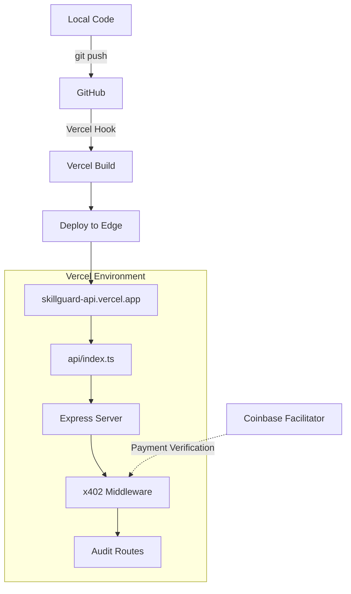
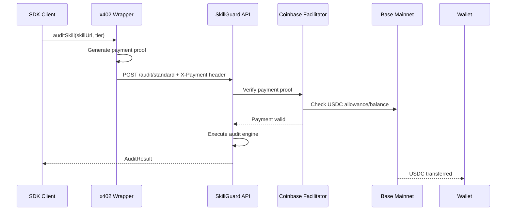
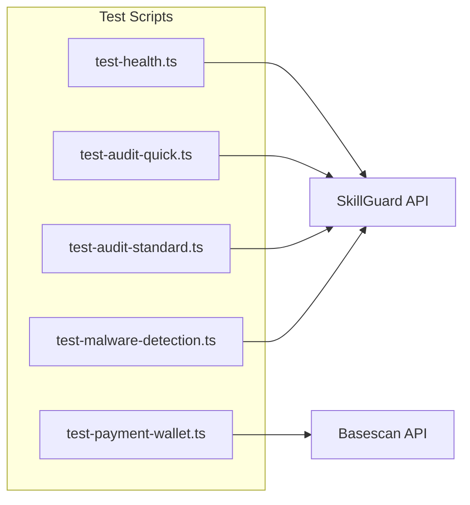

# Design Document: Mainnet Deployment & x402 Testing

## Overview

This design covers the deployment of SkillGuard to Base mainnet via Vercel and comprehensive end-to-end testing of the x402 payment protocol. The system already has x402 integration implemented - this phase focuses on deployment verification and real-world payment testing.

## Code Reuse Analysis

### Existing Components to Leverage

- **`server/src/middleware/x402.ts`**: x402 payment middleware with tier pricing ($0.05/$0.15/$0.50)
- **`server/src/config/index.ts`**: Zod-validated environment configuration (already hardcoded to Base mainnet)
- **`packages/skillguard-client/src/index.ts`**: SDK with x402 payment wrapper and all audit methods
- **`server/src/routes/audit.ts`**: Audit endpoint with tier-based pricing
- **`server/src/services/auditEngine/`**: Complete audit engine (YARA, permissions, network, risk)
- **`examples/basic-audit.ts`**: Reference implementation for testing

### Integration Points

- **x402 Protocol**: `@x402/express` middleware on server, `@x402/fetch` wrapper on client
- **Coinbase Facilitator**: `https://api.cdp.coinbase.com/platform/v2/x402`
- **Base Mainnet**: Chain ID 8453, USDC at `0x833589fCD6eDb6E08f4c7C32D4f71b54bdA02913`
- **Vercel**: Serverless deployment via `api/index.ts` entry point

## Architecture

### Deployment Flow



### x402 Payment Flow



### Test Suite Architecture



## Components and Interfaces

### Component 1: Vercel Deployment Configuration

- **Purpose**: Configure serverless deployment for mainnet
- **Interfaces**: `vercel.json`, environment variables in Vercel dashboard
- **Dependencies**: `@vercel/node` build adapter
- **Reuses**: Existing `server/api/index.ts` handler

**Current Configuration (already complete)**:
```json
{
  "version": 2,
  "builds": [{ "src": "api/index.ts", "use": "@vercel/node" }],
  "routes": [{ "src": "/(.*)", "dest": "api/index.ts" }],
  "env": {
    "NODE_ENV": "production",
    "X402_NETWORK": "eip155:8453"
  }
}
```

### Component 2: Test Script Suite

- **Purpose**: Verify deployment and x402 payment flow on mainnet
- **Interfaces**: CLI scripts executable via `npx tsx`
- **Dependencies**: `skillguard-client` SDK, `viem` for wallet operations
- **Location**: `examples/tests/`

**Test Scripts**:
1. `test-health.ts` - Free health check endpoint
2. `test-payment-quick.ts` - $0.05 quick audit with payment
3. `test-payment-standard.ts` - $0.15 standard audit with payment
4. `test-malware-detection.ts` - Verify detection of known patterns
5. `verify-wallet-balance.ts` - Check USDC received in wallet

### Component 3: Test Skill Files

- **Purpose**: Provide known-good and known-bad skills for testing
- **Interfaces**: Static markdown/code files
- **Location**: `examples/test-skills/`

**Test Cases**:
1. `safe-weather-skill.md` - Clean skill, should return SAFE
2. `malicious-credential-theft.md` - Contains `~/.aws/credentials` access
3. `malicious-exfiltration.md` - Contains webhook.site POST
4. `malicious-destructive.md` - Contains `rm -rf /`

## Data Models

### Test Result Model
```typescript
interface TestResult {
  testName: string;
  passed: boolean;
  duration: number; // ms
  paymentAmount?: string; // USDC
  auditResult?: AuditResult;
  error?: string;
}
```

### Wallet Balance Model
```typescript
interface WalletCheck {
  address: string;
  balanceBefore: bigint;
  balanceAfter: bigint;
  expectedIncrease: bigint;
  actualIncrease: bigint;
  matched: boolean;
}
```

## Error Handling

### Error Scenarios

1. **402 Payment Required**
   - **Handling**: Server returns 402 with x402 payment requirements
   - **User Impact**: Client SDK automatically generates payment and retries

2. **Payment Verification Failed**
   - **Handling**: Facilitator returns error, server rejects with 402
   - **User Impact**: "Payment verification failed" error with details

3. **Insufficient USDC Balance**
   - **Handling**: x402 wrapper catches, throws descriptive error
   - **User Impact**: "Insufficient USDC balance for tier X ($Y required)"

4. **Skill URL Unreachable**
   - **Handling**: Server returns 400 with "Failed to fetch skill content"
   - **User Impact**: Clear message to check URL accessibility

5. **Audit Engine Timeout**
   - **Handling**: 30s timeout, returns 500 with partial results if possible
   - **User Impact**: "Audit timed out - try quick tier"

## Testing Strategy

### Unit Testing
Not applicable for this deployment/integration spec - focus is on E2E.

### Integration Testing

**Pre-deployment (local)**:
1. Build server: `cd server && pnpm build`
2. Run local server: `pnpm start`
3. Test health endpoint: `curl localhost:3000/health`

### End-to-End Testing

**Post-deployment (mainnet)**:

| Test | Endpoint | Payment | Expected |
|------|----------|---------|----------|
| Health check | GET /health | None | `{ status: "ok" }` |
| Pricing info | GET /pricing | None | All 3 tiers |
| Quick audit | POST /audit/quick | $0.05 USDC | AuditResult |
| Standard audit | POST /audit/standard | $0.15 USDC | AuditResult with permissions |
| Malware: creds | POST /audit/quick | $0.05 USDC | CRITICAL, BLOCKED |
| Malware: exfil | POST /audit/quick | $0.05 USDC | HIGH, DANGEROUS |
| Clean skill | POST /audit/quick | $0.05 USDC | LOW, SAFE |
| Wallet verify | Basescan API | N/A | Balance increased |

### Test Execution Order

1. **Phase 1: Free Endpoints** (no payment)
   - Health check
   - Pricing endpoint

2. **Phase 2: Paid Audits** (requires funded wallet)
   - Quick audit of safe skill
   - Standard audit of safe skill
   - Quick audit of malicious skill

3. **Phase 3: Payment Verification**
   - Check wallet balance before/after
   - Verify correct USDC amounts received

### Required Test Infrastructure

1. **Funded Test Wallet**: Private key with USDC on Base mainnet
2. **Test Skills**: Hosted at accessible URLs or use raw content
3. **Basescan API**: For wallet balance verification (free tier)

## Deployment Checklist

### Pre-Deployment
- [ ] Verify `X402_PAY_TO_ADDRESS` is correct in Vercel environment
- [ ] Ensure test wallet has sufficient USDC on Base mainnet
- [ ] Build passes: `cd server && pnpm build`

### Deployment
- [ ] Deploy to Vercel: `cd server && vercel --prod`
- [ ] Verify deployment URL is live

### Post-Deployment Verification
- [ ] Health endpoint returns 200
- [ ] Pricing endpoint returns all tiers
- [ ] Quick audit accepts payment and returns result
- [ ] Malware detection works correctly
- [ ] Wallet receives USDC payments
