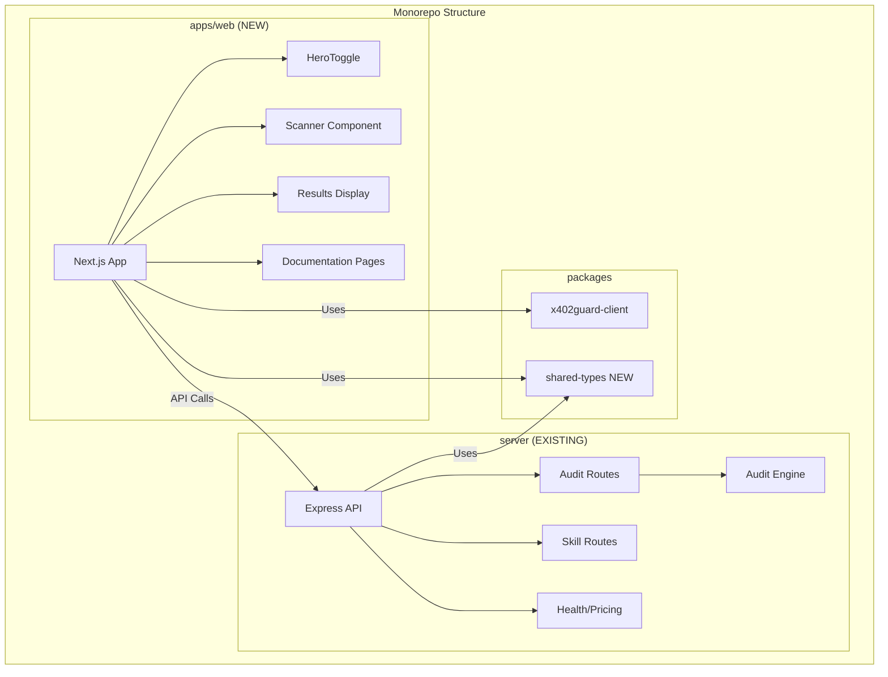

# Design Document: Monorepo UI, Documentation & SKILL.md Update

## Overview

This design creates a unified x402guard platform by adding a modern web UI to the existing API-only monorepo, syncing SKILL.md content from skillscan-web, and ensuring comprehensive documentation. The UI will be built as a new package within the monorepo using Next.js (matching skillscan-web patterns) and will integrate with the existing Express backend.

## Code Reuse Analysis

### From skillscan-web (Source Project)
- **lib/skill-content.ts**: SKILL_MD_CONTENT and SKILL_METADATA - copy to server/src/content/
- **components/sections/HeroToggle.tsx**: Human/Agent toggle pattern - adapt for new UI
- **components/ui/CodeBlock.tsx**: Copy button code block - reuse pattern
- **lib/hooks/useX402Payment.ts**: x402 payment integration - adapt for new UI

### Existing Components in skillguard-monorepo to Leverage
- **server/src/services/auditEngine/**: All scanning logic (yaraScanner, permissionAnalyzer, networkDetector, riskCalculator)
- **server/src/types/api.ts**: TypeScript type definitions for API responses
- **server/src/routes/**: Existing API route patterns
- **packages/x402guard-client/**: SDK for client-side integration
- **docs/**: Existing documentation structure to extend

### Integration Points
- **Express API (server/)**: UI will call existing /audit/* endpoints
- **x402 Payment**: UI will use @x402/fetch for payment handling
- **Skill Serving**: UI will display skill.md content from API

## Architecture



## Project Structure

```
skillguard-monorepo/
├── apps/
│   └── web/                      # NEW: Next.js frontend
│       ├── app/
│       │   ├── page.tsx          # Home with HeroToggle
│       │   ├── layout.tsx        # Root layout
│       │   ├── docs/             # Documentation pages
│       │   │   ├── page.tsx      # Docs index
│       │   │   └── [slug]/       # Dynamic doc pages
│       │   └── api/              # API routes (proxy to server)
│       ├── components/
│       │   ├── ui/               # Base UI components
│       │   │   ├── Button.tsx
│       │   │   ├── Card.tsx
│       │   │   ├── CodeBlock.tsx
│       │   │   └── Badge.tsx
│       │   ├── sections/         # Page sections
│       │   │   ├── HeroToggle.tsx
│       │   │   ├── Scanner.tsx
│       │   │   ├── Results.tsx
│       │   │   └── Features.tsx
│       │   └── providers/
│       │       └── WalletProvider.tsx
│       ├── lib/
│       │   ├── hooks/
│       │   │   └── useX402Payment.ts
│       │   └── utils.ts
│       ├── package.json
│       └── tailwind.config.ts
├── packages/
│   ├── x402guard-client/         # EXISTING: SDK
│   └── shared-types/             # NEW: Shared TypeScript types
│       ├── src/
│       │   └── index.ts
│       └── package.json
├── server/                       # EXISTING: Express API
│   └── src/
│       └── content/
│           ├── skill.md          # UPDATE: Sync from skillscan-web
│           └── skill-metadata.ts # NEW: Structured metadata
├── docs/                         # UPDATE: Comprehensive docs
│   ├── README.md
│   ├── QUICKSTART.md
│   ├── API_REFERENCE.md
│   ├── SDK_REFERENCE.md
│   ├── DETECTION_RULES.md
│   ├── RISK_SCORING.md
│   ├── AGENT_INTEGRATION.md
│   ├── SELF_HOSTING.md
│   └── DEPLOYMENT.md
└── README.md                     # UPDATE: New features
```

## Components and Interfaces

### HeroToggle Component
- **Purpose**: Dual-path hero section for humans and AI agents
- **Location**: apps/web/components/sections/HeroToggle.tsx
- **Interfaces**:
  ```typescript
  type UserType = "human" | "agent";
  type TabType = "prompt" | "manual";

  export function HeroToggle(): JSX.Element
  ```
- **State**: userType, activeTab
- **Reuses**: Pattern from skillscan-web HeroToggle

### Scanner Component
- **Purpose**: Interactive skill scanning interface
- **Location**: apps/web/components/sections/Scanner.tsx
- **Interfaces**:
  ```typescript
  interface ScannerProps {
    onScanComplete: (result: AuditResult) => void;
  }

  export function Scanner({ onScanComplete }: ScannerProps): JSX.Element
  ```
- **Features**: URL input, content paste, tier selection, wallet connection

### Results Component
- **Purpose**: Display audit results with visualizations
- **Location**: apps/web/components/sections/Results.tsx
- **Interfaces**:
  ```typescript
  interface ResultsProps {
    result: AuditResult | null;
    isLoading: boolean;
  }

  export function Results({ result, isLoading }: ResultsProps): JSX.Element
  ```
- **Features**: Risk score gauge, findings breakdown, recommendations

### useX402Payment Hook
- **Purpose**: Handle x402 payment flow with wallet
- **Location**: apps/web/lib/hooks/useX402Payment.ts
- **Interfaces**:
  ```typescript
  interface UseX402PaymentReturn {
    fetchWithPayment: typeof fetch | null;
    paymentState: PaymentState;
    error: string | null;
    isReady: boolean;
    resetState: () => void;
  }

  export function useX402Payment(): UseX402PaymentReturn
  ```
- **Reuses**: Pattern from skillscan-web

## Data Models

### AuditResult (shared-types)
```typescript
interface AuditResult {
  risk_score: number;        // 0-100
  risk_level: "LOW" | "MEDIUM" | "HIGH" | "CRITICAL";
  recommendation: "SAFE" | "CAUTION" | "DANGEROUS" | "BLOCKED";
  findings: {
    malware: MalwareMatch[];
    credentials: CredentialRisk[];
    network: NetworkCall[];
    permissions: Permission[];
  };
  audit_id: string;
  timestamp: string;
  tier: "quick" | "standard" | "deep";
  attestation?: Attestation;  // deep tier only
}
```

### SkillMetadata (from skill-content.ts)
```typescript
interface SkillMetadata {
  name: string;
  description: string;
  version: string;
  author: string;
  homepage: string;
  metadata: {
    openclaw: {
      requires: { env: string[]; bins: string[] };
    };
  };
  endpoints: Record<string, EndpointInfo>;
  pricing: PricingInfo;
  documentation: DocumentationLinks;
}
```

## UI Layout Mockups

### Homepage - Human Selected
```
┌─────────────────────────────────────────────────────────────┐
│  x402guard                          [Docs] [Connect Wallet] │
├─────────────────────────────────────────────────────────────┤
│                                                             │
│              ⚡ Powered by x402 Protocol                    │
│                                                             │
│   ┌──────────────┐  ┌──────────────┐                       │
│   │ I'm a Human  │  │ I'm an Agent │                       │
│   │   [active]   │  │              │                       │
│   └──────────────┘  └──────────────┘                       │
│                                                             │
│                  Secure Every                               │
│                 Agent Skill                                 │
│                                                             │
│   ┌─────────────────────────────────────────────────────┐  │
│   │  Enter skill URL or paste content...                │  │
│   └─────────────────────────────────────────────────────┘  │
│                                                             │
│   ┌─────────┐  ┌─────────────┐  ┌─────────┐               │
│   │ Quick   │  │  Standard   │  │  Deep   │               │
│   │ $0.05   │  │   $0.15     │  │  $0.50  │               │
│   │  ○      │  │     ●       │  │   ○     │               │
│   └─────────┘  └─────────────┘  └─────────┘               │
│                                                             │
│              [ Scan Now → ]                                 │
│                                                             │
└─────────────────────────────────────────────────────────────┘
```

### Homepage - Agent Selected
```
┌─────────────────────────────────────────────────────────────┐
│   ┌──────────────┐  ┌──────────────┐                       │
│   │ I'm a Human  │  │ I'm an Agent │                       │
│   │              │  │   [active]   │                       │
│   └──────────────┘  └──────────────┘                       │
│                                                             │
│                Security for AI Agents                       │
│                                                             │
│       ┌────────┐  ┌────────┐                               │
│       │ prompt │  │ manual │                               │
│       └────────┘  └────────┘                               │
│                                                             │
│   ┌─────────────────────────────────────────────────────┐  │
│   │ Read https://x402guard.xyz/skill.md and follow     │  │
│   │ the instructions to scan a skill         [copy]    │  │
│   └─────────────────────────────────────────────────────┘  │
│                                                             │
│   1. Send skill.md URL to your agent                       │
│   2. Agent reads instructions & signs x402 payment         │
│   3. Receive audit results with risk score                 │
│                                                             │
│              [ View API Docs → ]                            │
└─────────────────────────────────────────────────────────────┘
```

### Results Display
```
┌─────────────────────────────────────────────────────────────┐
│                     SCAN RESULTS                            │
├─────────────────────────────────────────────────────────────┤
│                                                             │
│   ┌───────────────────────────────────────────────────┐    │
│   │          Risk Score: 15/100                       │    │
│   │          ████████░░░░░░░░░░░░░░░░░░░░░░░░░░░░░    │    │
│   │                                                   │    │
│   │   Level: LOW          Recommendation: SAFE        │    │
│   └───────────────────────────────────────────────────┘    │
│                                                             │
│   Findings:                                                 │
│   ┌─────────────────────────────────────────────────────┐  │
│   │ ✓ Malware: None detected                           │  │
│   │ ✓ Credentials: No sensitive access                 │  │
│   │ ⚠ Network: 1 external call (api.weather.com)       │  │
│   │ ✓ Permissions: Minimal                             │  │
│   └─────────────────────────────────────────────────────┘  │
│                                                             │
│   Audit ID: aud_abc123    Tier: Standard                   │
│                                                             │
│   [ Scan Another ] [ View Full Report ]                    │
└─────────────────────────────────────────────────────────────┘
```

## Documentation Structure

### docs/README.md (Index)
```markdown
# x402guard Documentation

## Quick Links
- [Quickstart](./QUICKSTART.md) - Get started in 5 minutes
- [API Reference](./API_REFERENCE.md) - HTTP API docs
- [SDK Reference](./SDK_REFERENCE.md) - TypeScript SDK

## Core Concepts
- [The Problem](./PROBLEM.md)
- [Security Layers](./SECURITY_LAYERS.md)
- [Skills Explained](./SKILLS_EXPLAINED.md)

## Guides
- [Agent Integration](./AGENT_INTEGRATION.md)
- [Deployment](./DEPLOYMENT.md)
- [Self-Hosting](./SELF_HOSTING.md)

## Reference
- [Detection Rules](./DETECTION_RULES.md)
- [Risk Scoring](./RISK_SCORING.md)
```

## Error Handling

### Wallet Not Connected
- **Handling**: Show "Connect Wallet" button, disable scan
- **User Impact**: Clear prompt to connect wallet before scanning

### Payment Failed
- **Handling**: Show error message with retry option
- **User Impact**: "Payment failed. Please try again or check your USDC balance."

### API Error
- **Handling**: Show error with status code and message
- **User Impact**: "Scan failed (502). The server may be temporarily unavailable."

### Invalid Skill URL
- **Handling**: Validate URL format before submission
- **User Impact**: "Please enter a valid HTTPS URL"

## Testing Strategy

### Unit Testing
- Test HeroToggle state transitions
- Test Results component with various risk levels
- Test useX402Payment hook states

### Integration Testing
- Test Scanner → API → Results flow
- Test wallet connection flow
- Test payment handling with mock x402

### End-to-End Testing
- Complete scan flow from URL input to results
- Human/Agent toggle functionality
- Documentation navigation

## Technology Choices

| Component | Technology | Rationale |
|-----------|------------|-----------|
| UI Framework | Next.js 14 | Matches skillscan-web, SSR support |
| Styling | Tailwind CSS | Matches existing project |
| Animations | Framer Motion | Matches skillscan-web |
| Wallet | Wagmi + Viem | Industry standard for Web3 |
| State | React hooks | Simple, no external state lib needed |
| Build | Turbo | Existing monorepo tool |
