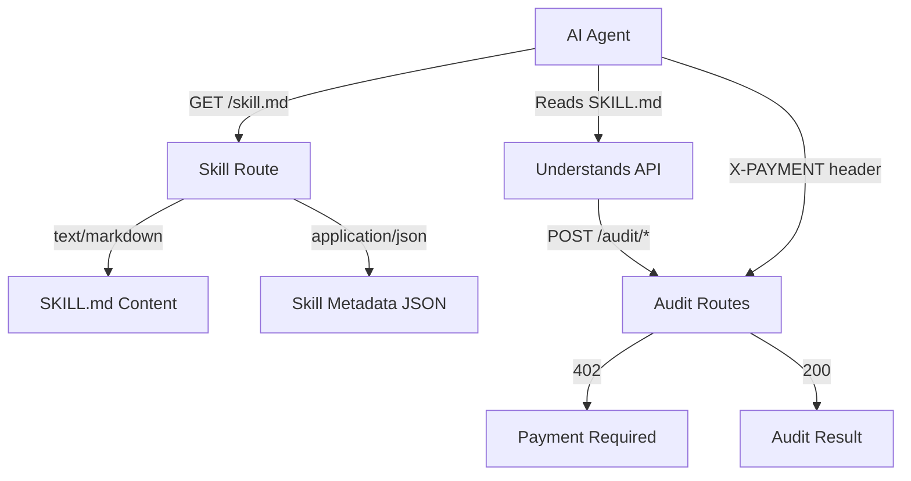

# Design Document: SKILL.md Integration

## Overview

This feature adds a SKILL.md file and API endpoint that enables AI agents (OpenClaw, LangChain, etc.) to discover and use x402guard for security scanning. The SKILL.md follows OpenClaw's skill format and teaches agents how to:
1. Call audit endpoints
2. Pay using x402 protocol (USDC on Base)
3. Interpret scan results
4. Make install/block decisions

## Steering Document Alignment

### Technical Standards
- Express.js for API routes (consistent with existing `server/src/routes/`)
- TypeScript for type safety
- Markdown with YAML frontmatter for SKILL.md format

### Project Structure
- New route: `server/src/routes/skill.ts`
- Static content: `server/src/content/skill.md`
- Types: Extend `server/src/types/api.ts`

## Code Reuse Analysis

### Existing Components to Leverage
- **Express Router**: Use same pattern as `audit.ts` and `health.ts`
- **Error Handler**: Reuse `AppError` from `middleware/errorHandler.js`
- **Config**: Reuse `config` for pricing info

### Integration Points
- **Audit Routes**: Reference in SKILL.md documentation
- **x402 Middleware**: Document payment flow based on existing implementation

## Architecture



### Modular Design Principles
- **Single File Responsibility**: `skill.ts` handles only skill serving
- **Component Isolation**: SKILL.md content separate from route logic
- **Content Separation**: Markdown content in `content/` directory

## Components and Interfaces

### Component 1: Skill Route (`server/src/routes/skill.ts`)
- **Purpose:** Serve SKILL.md content via HTTP
- **Interfaces:**
  - `GET /skill.md` - Returns SKILL.md as markdown
  - `GET /skills/x402guard.md` - Alternative path (ClawHub style)
  - `GET /skill.json` - Returns structured metadata
- **Dependencies:** Express, fs, path
- **Reuses:** Express router pattern from existing routes

### Component 2: SKILL.md Content (`server/src/content/skill.md`)
- **Purpose:** Teaching document for AI agents
- **Format:** Markdown with YAML frontmatter
- **Sections:**
  - Metadata (name, description, requires)
  - API Documentation
  - x402 Payment Instructions
  - Code Examples
  - Response Interpretation

### Component 3: Skill Metadata Type (`server/src/types/api.ts`)
- **Purpose:** TypeScript interface for skill metadata
- **Fields:** name, description, version, endpoints, pricing

## Data Models

### SkillMetadata
```typescript
interface SkillMetadata {
  name: string;                    // "x402guard"
  description: string;             // "Pre-install security scanning for AI agent skills"
  version: string;                 // "0.1.0"
  author: string;                  // "x402guard"
  metadata: {
    openclaw: {
      requires: {
        env: string[];             // ["WALLET_PRIVATE_KEY"]
        bins: string[];            // []
      }
    }
  };
  endpoints: {
    audit_quick: EndpointInfo;
    audit_standard: EndpointInfo;
    audit_deep: EndpointInfo;
  };
  pricing: {
    network: string;               // "eip155:8453"
    asset: string;                 // USDC address
    tiers: Record<string, string>; // { quick: "50000", ... }
  };
}

interface EndpointInfo {
  method: string;
  path: string;
  description: string;
  price_usdc: string;
}
```

### SKILL.md Frontmatter
```yaml
---
name: x402guard
description: Pre-install security scanning for AI agent skills. Pay with USDC via x402.
version: 0.1.0
metadata:
  openclaw:
    requires:
      env:
        - WALLET_PRIVATE_KEY
      bins: []
---
```

## API Endpoints

### GET /skill.md
- **Request:** No body required
- **Response:** `Content-Type: text/markdown`
- **Rate Limit:** 100 requests/minute

### GET /skill.json
- **Request:** No body required
- **Response:** `Content-Type: application/json`
```json
{
  "name": "x402guard",
  "description": "Pre-install security scanning",
  "endpoints": {...},
  "pricing": {...}
}
```

### GET /skills/x402guard.md
- **Alias for:** `/skill.md`
- **Purpose:** ClawHub compatibility

## SKILL.md Content Structure

```markdown
---
name: x402guard
description: Pre-install security scanning for AI agent skills
metadata:
  openclaw:
    requires:
      env: [WALLET_PRIVATE_KEY]
---

# x402guard Skill

## What This Skill Does
Scans AI agent skills for malware, credential theft, and data exfiltration
BEFORE installation. Pay per scan with USDC on Base.

## Available Commands

### Scan a Skill (Quick - $0.05)
[Instructions + curl example]

### Scan a Skill (Standard - $0.15)
[Instructions + curl example]

### Scan a Skill (Deep - $0.50)
[Instructions + curl example]

## Payment Flow (x402)
[Step-by-step x402 payment instructions]

## Understanding Results
[How to interpret SAFE/CAUTION/DANGEROUS/BLOCKED]

## Examples
[Working code examples in curl and JavaScript]
```

## Error Handling

### Error Scenarios
1. **SKILL.md file not found**
   - **Handling:** Return bundled fallback content
   - **User Impact:** Still receives valid SKILL.md

2. **Invalid Accept header**
   - **Handling:** Default to markdown format
   - **User Impact:** Gets markdown content

3. **Rate limit exceeded**
   - **Handling:** Return 429 with Retry-After header
   - **User Impact:** Temporary delay, can retry

## Testing Strategy

### Unit Testing
- Test skill route returns correct content-type
- Test JSON metadata structure
- Test fallback when file missing

### Integration Testing
- Test full request/response cycle
- Test rate limiting behavior
- Test content negotiation

### End-to-End Testing
- Test AI agent can read and parse SKILL.md
- Test documented curl examples work
- Test payment flow examples are accurate
